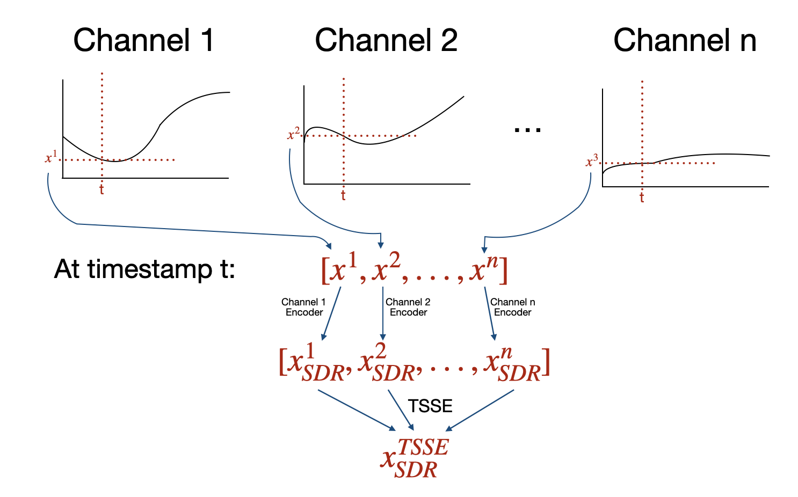

# HTM Model for Anomaly Detection: Multi-Channel Encoding Strategies on SWaT Dataset

## Overview
This project explores various multi-channel encoding strategies for anomaly detection using HTM model on the Secure Water Treatment (SWaT) dataset. We explore different approaches to effectively encode multiple sensor channels while trying to minimize FPs and maximize TPs.

## Encoding Strategies

### 1. Timestamp TSSE
- For every timestamp: encodes each channel's value using channel specific encoders and applies TSSE to combine encodings into a unified multi-channel representation.
- Note: for channels with different sdr sizes, we pad the shorter encoding with zeros to match the length of the longest encoding. This can cause larger channels to dominate the shorter ones.



### 2. Spatial Encoding
- For every timestamp: encodes each channel's value using channel specific encoders and concatenates individual encodings into a single spatial representation.
- Note: maintains consistent active bit count across all channel encoders

### 3. Temporal Encoding
**Parameters:**
- `buffer_size`: Number of timesteps to consider

**Process:**
- Maintains a buffer of spatial encodings over time and applies TSSE to the buffer to get a temporal encoding.

### 4. Combined Approach
**Parameters:**
- `buffer_size`: Number of timesteps to consider
- `spatial_weight`: Weight for spatial anomaly score (0-1)
- `temporal_weight`: Weight for temporal anomaly score (0-1)

**Process:**
- Generates both spatial and temporal encodings per timestamp
- Processes each encoding through separate TMs
- Combines anomaly scores using weighted average:
  ```
  final_score = spatial_weight * spatial_score + temporal_weight * temporal_score
  ```
